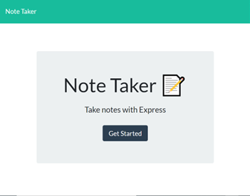
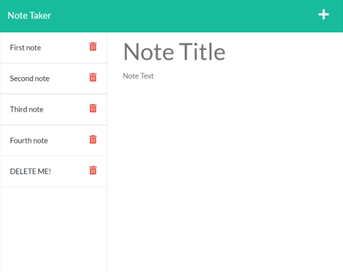

# **Note Taker Application**

## **Description**
The purpose of this project was to develop an application that could be used to create, save, and delete notes. The front end of the application was already completed and provided. Therefore the project tasks entailed building the back end components, connecting the front end and back end, and then deploying the application to Heroku.

## **Table of Contents**
[User Story](#user-story) 
[Acceptance Criteria](#acceptance-criteria) 
[Installation](#installation) 
[Usage](#usage) 
[License](#license) 
[Contributing](#contributing) 
[Tests](#tests) 
[Assets Utilized](#assets-utilized) 
[Built With](#built-with) 
[Deliverable](#deliverable) 

### **User Story**
AS A small business owner 
I WANT to be able to write, save, and delete notes 
SO THAT I can organize my thoughts and keep track of tasks I need to complete 

### **Acceptance Criteria**
GIVEN a note-taking application 
WHEN I open the Note Taker 
THEN I am presented with a landing page with a link to a notes page 
WHEN I click on the link to the notes page 
THEN I am presented with a page with existing notes listed in the left-hand column, plus empty fields to enter a new note title and the note’s text in the right-hand column 
WHEN I enter a new note title and the note’s text 
THEN a Save icon appears in the navigation at the top of the page 
WHEN I click on the Save icon 
THEN the new note I have entered is saved and appears in the left-hand column with the other existing notes 
WHEN I click on an existing note in the list in the left-hand column 
THEN that note appears in the right-hand column 
WHEN I click on the Write icon in the navigation at the top of the page 
THEN I am presented with empty fields to enter a new note title and the note’s text in the right-hand column 
WHEN I click on the Delete icon next to each note 
THEN that note disappears in the right-hand column 

### **Installation**
No installation needed

### **Usage**
Users simply have to click on the button "Get Started" that appears on the main landing page of the application as depicted below:

Then, they will be taken to a new page where they will see notes on the left-hand side with the ability to enter notes on the right-hand side of the page by clicking the "Plus" sign. 

Notes can be saved by the "Save" icon that will appear when a user begins writing a new note. Users can also delete notes as needed by clicking on the Delete icon (trash can) to the right of each note. 

### **License**
  This project is covered under the following license: ISC 
  https://opensource.org/licenses/ISC

### **Contributing**
This project does not include any contributors

### **Tests**
No tests were used to develop this application

### **Assets Utilized** 

- __public__ folder containing all HTML, CSS, and Javascript files (provided at outset of project)
- __lib__ folder containing notes.js file
- routes folder containing both all route files
- db.json
- server.js

### **Built With**
* HTML 
* CSS 
* JavaScript
* Node.js
* npm
* Express.js
* UUID

### **Deliverable**
 Application deployed on Heroku:
 https://serene-thicket-59386.herokuapp.com/
